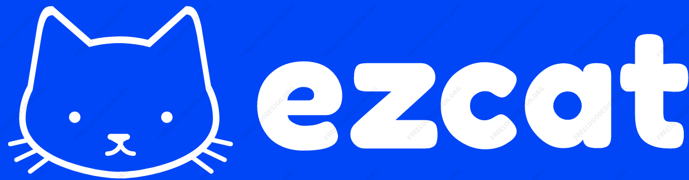

# EZCAT: an Easy Conversation Annotation Tool

This online annotation tool was first fully dedicated to the annotation campaign made at Télécom Paris and SNCF. While the annotation campaign is over, this annotation tool is still hosted online. We refactored the tool and made it into a customizable applciation dedicated to conversation annotation. We also added some features such as the import of instant messaging applications' conversation in order to enable their easy annotation.

## Live Version

[https://gguibon.github.io/ezcat/](https://gguibon.github.io/ezcat/)


## New feature on EZCAT 1.2.0

EZCAT 1.2.0 comes with one requested feature: local storage for the annotaion config.
You can now decide to either save the configuration on memory (which disappear upon closing the tab), or save / erase the configuration from the local storage of your browser. This prevents having to load the configuration file everytime.

## New features on EZCAT 1.1.0

EZCAT 1.1.0 comes with some new features:
- multilabel at the message level
- multiple label types at the message level
- new message level display (chips), customizable for each label (`listselect` or `chip`). Chips are now the default display for message level labels as it allows a faster annotation process
- fix: intermediate display on big phones. Now the labels are always visible even in intermediate to small screens
- fix: the app will automatically fix the underlaying data representation to correspond to multilabels for message labels

## Citation

If you found this work useful, please cite the following paper:

```
@inproceedings{guibon-2022-ezcat,
    title = "EZCAT: an Easy Conversation Annotation Tool",
    author = {Guibon, Ga{\"e}l  and
      Labeau, Matthieu  and
      Lefeuvre, Luce  and
      Clavel, Chlo{\'e}},
    booktitle = "Proceedings of the 13th Language Resources and Evaluation Conference",
    month = june,
    year = "2022",
    address = "Marseille, France",
    publisher = "European Language Resources Association",
    abstract = "Users generate content constantly, leading to new data requiring annotation. Among this data, textual conversations are created every day and come with some specificities: they are mostly private through instant messaging applications, requiring the conversational context to be labeled. These specificities led to several annotation tools dedicated to conversation, and mostly dedicated to dialogue tasks, requiring complex annotation schemata, not always customizable and not taking into account conversation-level labels. In this paper, we present EZCAT, an easy-to-use interface to annotate conversations in a two-level configurable schema, leveraging message-level labels and conversation-level labels at once. Our interface is characterized by the voluntary absence of a server and accounts management, enhancing its availability to anyone, and the control over data, which is crucial to confidential conversations. We also present our first usage of EZCAT along with our annotation schema we used to annotate confidential customer service conversations. EZCAT is freely available at https://gguibon.github.io/ezcat",
    language = "English",
}
```

## Install the dependencies
```bash
npm install
```

### Start the app in development mode (hot-code reloading, error reporting, etc.)
```bash
quasar dev
```


### Build the app for production
```bash
quasar build
```

### Customize the configuration
See [Configuring quasar.conf.js](https://quasar.dev/quasar-cli/quasar-conf-js).


## Electron Builds for Desktop Installers

See [Reference](https://electron.github.io/electron-packager/main/)

```
quasar build -m electron -t [linux|macOS]
```

Then cd to 
```
cd dist/electron/UnPackaged
```

```
sudo apt install fakeroot
```

```
npx electron-packager . ezcat --platform [linux|darwin] --arch x64 --out dist/
```
where `app` is the name of the application (`poc` for instance)


### package for debian
```
electron-installer-debian --src dist/ezcat-linux-x64/ --dest dist/installers/ --arch amd64
```

### package for mac OS

```
electron-installer-dmg dist/ezcat-darwin-x64/ezcat.app dist/installers/ --icon img/ezcatfavicon.png --title EZCAT --out dist/installers/
```


## Cordova Builds for Mobile Installers

### package for android

```
quasar build -m cordova -T android
cd src-cordova/
npm install cordova-android
cd ..
quasar build -m cordova -T android
```

to finish

# Improvements Coming Soon

- [x] local storage for configuration file (optional)
- [ ] project dedicated README
- [ ] separated technical README
- [ ] wiki/docs for usage
- [ ] provide native installers

# Contacts


Application made by [Gaël Guibon](https://gguibon.github.io)


